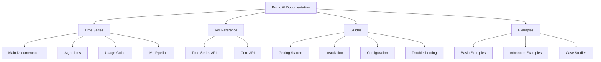

# Bruno AI Documentation

## Overview

Welcome to the Bruno AI documentation wiki. This central hub provides access to all documentation for the Bruno AI platform and its components.

## Contents

### Time Series Forecasting

- **[Main Documentation](../src/services/timeSeries/README.md)**: Overview of the Time Series Forecasting module
- **[Algorithms](../src/services/timeSeries/docs/ALGORITHMS.md)**: Detailed explanation of forecasting algorithms
- **[Usage Guide](../src/services/timeSeries/docs/USAGE_GUIDE.md)**: Practical examples and best practices
- **[ML Pipeline](../src/services/timeSeries/ml/README.md)**: Machine Learning pipeline integration

### API Reference

- **[Time Series API](time-series-api.md)**: API reference for the Time Series module
- **[Core API](core-api.md)**: Core API reference

### Guides

- **[Getting Started](getting-started.md)**: Quick start guide for new users
- **[Installation](installation.md)**: Detailed installation instructions
- **[Configuration](configuration.md)**: Configuration options
- **[Troubleshooting](troubleshooting.md)**: Common issues and solutions

### Examples

- **[Basic Examples](examples/basic.md)**: Simple examples for beginners
- **[Advanced Examples](examples/advanced.md)**: Advanced usage examples
- **[Case Studies](examples/case-studies.md)**: Real-world case studies

## Navigation Map

## Documentation Style Guide

When contributing to documentation, please follow these guidelines:

- Use Markdown for all documentation
- Include code examples where appropriate
- Use proper headings and structure
- Include links to related documentation
- Add tables for structured data
- Include diagrams when explaining complex concepts

## Recent Updates

- **2025-05-10**: Added Time Series ML Pipeline documentation
- **2025-05-10**: Reorganized Time Series module documentation
- **2025-05-10**: Added algorithm technical details

## Contributing to Documentation

To contribute to this documentation:

1. Fork the repository
2. Make your changes
3. Submit a pull request with a clear description of your changes

Please ensure your documentation follows the style guide and is clear, concise, and helpful.
